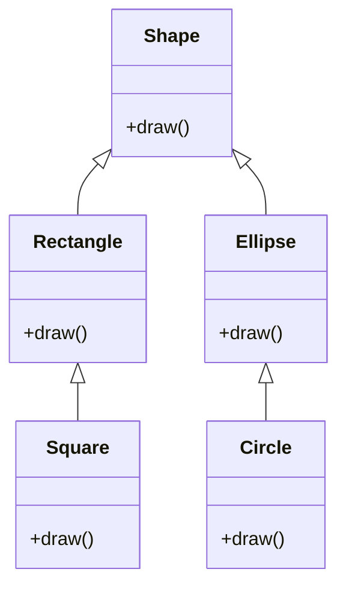

首先看一个案例，当需要做一个绘制图形的类，存在以下继承结构：



**`Shape`是什么形状？**
其中，`Rectangle`、`Square`……这几个子类是描述的某一具体的形状，但 `Shape`类不是具体的，而是抽象的。

## **抽象类**

我们称像 `Shape`这样表达某一种概念的类叫做**抽象类**

---

### **抽象方法**

抽象方法是表达概念而无法实现具体代码的函数

抽象方法是使用 `abstract`关键字修饰的成员方法，抽象方法在定义时不需要实现方法体，抽象方法的定义格式如下：

```java
abstract 返回值类型 方法名称（参数）；
```

:::warning

使用 `abstract`关键字修饰的抽象方法不能使用 `private`修饰，因为抽象方法必须被子类实现，如果使用 `private`声明，则子类无法实现该方法

:::

---

当一个类包含了抽象方法，则该类必须是抽象类，抽象类与抽象函数一样必须使用 `abstract`关键字进行修饰。抽象类的定义格式如下：

```java
public abstract class 抽象类名称{
      public abstract 返回值类型 方法名称（参数）；
}
```

:::warning

若一个类没有声明为抽象类但包含抽象方法会无法编译

:::

抽象类的定义规则如下：

- 包含抽象方法的类必须是抽象类
- 抽象类和抽象方法都要使用 `abstract`关键字进行声明
- 抽象方法只需要声明而不需要实现
- **如果一个抽象类继承了抽象类，那么该子类必须实现抽象类中的全部抽象方法**

**抽象类无法实例化对象**，但是可以定义变量，**任意继承了抽象类的非抽象类的对象可以付给这个变量**

```java
public static void main(String args[]){
     Square s = new Square();
     Shape c = s;   //这是可行的
}
```

:::important

无法实例化的抽象类有什么用？
因为抽象类本身被设计成只能用于被继承，因此，抽象类可以强迫子类实现其定义的抽象方法，否则编译会报错。因此，抽象方法实际上相当于定义了“规范”

:::

## **接口**

如果一个抽象类中所有的方法都是抽象类，则该类可定义为**接口**。接口是Java中最重要的概念之一

**类与类是单继承关系**，即一个子类只能有一个直接父类；但**类与接口是多实现关系**，即一个类可以实现多个接口；而**接口与接口是多继承关系**，即一个接口可以同时继承多个接口
