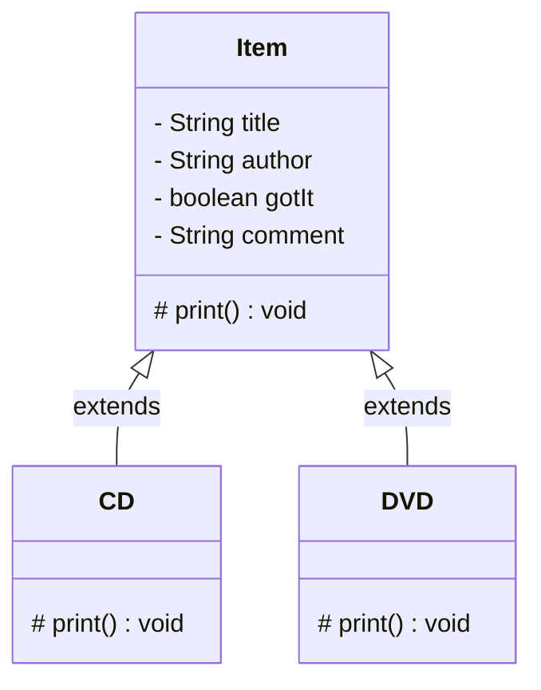

## 继承的概念

当我们发现某两个类中的非常相似，并且可以用相似的类去抽象构造，此时我们可以使用**继承**来减少书写重复代码，从而提高代码编写的效率。同时，降低代码相似度，从而易于后续的代码维护。

在程序中，继承描述的是事物之间的所属关系，通过继承可以使多种事物之间形成一种关系体系。例如：我们想要创建一个存放东西的数据库，里面所有的东西都可以称为一种 `item`，而具体物品有两种为 `CD`和 `DVD`



### `extends`

在Java中使用 `extends`关键字实现继承

```java
class CD extends Item{
   ....   //不需要重复定义Item中已经有的字段，只需要新增新的字段
}
```

我们将 `CD`这样的类称为**子类/扩展类**，而 `Item`称为**父类/超类**，子类和父类的关系是一种相对的概念，一个类既可以是某个类的子类，也可以是另一个类的父类。

在Java中，类只支持**单继承**，不支持**多继承**，即一个类只能有一个直接父类，一个类不能同时继承两个类，并且**Java中所有的类都默认继承 `Object`类**

:::caution[注意]

子类自动获得了父类的所有字段，严禁定义与父类重名的字段！

:::

## `protected`访问属性

当父类中的某个变量的访问属性为 `private`时，子类可以继承获得该变量，但是不能访问它，使用 `protected`访问属性，可以使子类获得访问父类中变量的权限。但是这样不好，如果子类和父类**不在同一个包**中，也无法访问到
解决办法：
我们可以将父类的变量在父类中初始化完成，再让子类获得该变量

```java
class Item{
   private title;
   public Item(String title){
       this.title = title;
   }
}
```

在子类的构造函数中通过 `super()`使用父类的构造函数对 `title`进行初始化

```java
class CD extends Item{
    public CD(String title){
        super(title);
    }
}
```

## `@Override`注解

**Override**（重写）是面向对象编程（OOP）中一个重要的概念，它允许子类提供其父类中定义的某个方法的具体实现。重写方法的目的是为了修改或扩展父类的方法行为，以适应子类的特定需求。
**重写的基本规则**：

1. **方法签名必须相同**：重写方法必须具有与被重写方法相同的方法名、参数列表和返回类型（或者返回类型的子类）。
2. **访问权限不能更低**：重写方法不能比被重写方法具有更低的访问权限。例如，如果父类方法是 `public`，那么子类方法也必须是 `public`，不能是 `protected`或 `private`。
3. **可以抛出更少或相同的异常**：重写方法抛出的异常不能比被重写方法的异常更广泛。也就是说，子类的重写方法可以不抛出异常，或者抛出父类方法的异常的子类。
4. **使用 `@Override`注解**：建议在重写的方法前使用 `@Override`注解，这样编译器会检查该方法是否真的在重写父类的方法。如果没有匹配的方法，会产生编译错误。

## `super()`关键字

当子类重写父类的方法后，子类对象将无法访问父类被重写的方法，为了解决这个问题，Java提供了 `super()`关键字。

### 调用父类构造器

当子类对象被创建时，构造器会首先调用父类的构造器。这是为了确保父类部分的初始化在子类部分之前完成。
初始化子类对象的顺序应为：父类属性赋值->父类构造函数->子类属性赋值->子类构造函数

#### 使用 `super()`

- `super()`: 调用父类的无参构造器
- `super(<参数>)`: 调用父类的带参数的构造器
  如果子类构造器中==没有显式调用== `super()` 或 `super(<参数>)`，编译器会在子类构造器的第一行**隐式地调用**父类的无参构造器，即 `super()`
  通过 `super()`调用父类构造方法的代码必须位于子类构造方法的第一行，并且只能出现一次

:::tip
即在子类的构造函数中，第一行写了 `super()`和不写的效果是一样的。但是如果父类没有无参构造器，而子类没有显式调用带参数的父类构造器，则会编译错误。
:::

### 访问父类成员

`super`关键字也用于访问父类的成员（字段和方法），特别是在子类中有与父类同名的成员时。

#### 访问父类的字段和方法

- `super.<父类成员>`: 引用父类的成员。

```java
class Parent {
    int num = 10;
  
    void display() {
        System.out.println("Parent display");
    }
}

class Child extends Parent {
    int num = 20;
  
    void display() {
        super.display(); // 调用父类的方法
        System.out.println("Child display");
    }
  
    void showNum() {
        System.out.println("Parent num: " + super.num); // 访问父类的字段
        System.out.println("Child num: " + this.num); // 访问子类的字段
    }
}

public class Test {
    public static void main(String[] args) {
        Child child = new Child();
        child.display(); // Output: Parent display
                         //         Child display
        child.showNum(); // Output: Parent num: 10
                         //         Child num: 20
    }
}
```

**`super()`和 `this`的区别**

| 区别点   | `this`                                                   | `super`                                |
| -------- | ---------------------------------------------------------- | ---------------------------------------- |
| 属性访问 | 访问本类中的属性，如果本类中没有该属性，则从父类中查找     | 直接访问父类中的属性                     |
| 方法     | 访问本类中的方法，如果本类中没有改方法，则从父类中继续查找 | 直接访问父类中的方法                     |
| 调用构造 | 调用本类构造，必须放在构造方法的首行                       | 调用父类构造，必须放在子类构造方法的首行 |

:::important
`this`和 `super()`不可以同时出现，因为在调用构造方法时都要求必须放在构造方法的首行
:::

## 子类和子类型

在面向对象编程中，类是对对象的抽象描述，它定义了对象的属性和行为。子类是从父类继承而来的，它扩展了父类的属性和行为，形成了一个新的类型，这个新类型被称为子类型。所以**类定义了类型，子类定义了子类型**

子类的对象可以被当作父类的对象来使用，具体可以表现为：

- 赋值给父类的变量（父类的对象管理者可以管理子类的对象）
- 传递给需要父类变量的函数
- 放进存放父类对象的容器里
