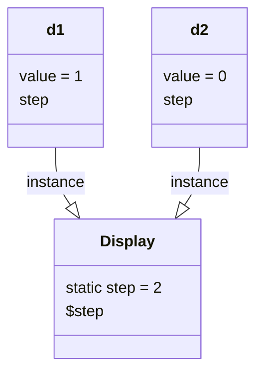

### **静态字段**

在 `class`中定义的字段，称为**实例字段**，每个实例（对象）都有独立的字段，各个实例的同名字段互不影响。

而使用 `static`修饰的字段，称为**静态字段**：`static field`

实例字段在每个实例中都独立存在，但静态字段所有实例都会共享该字段。如下：

```java
public class Display {
    private int value = 0;
    private int limit = 0;
    private static int step = 1;
  
    ......
  
    public static void main(String[] args){
        Display d1 = new Display(10);
        Display d2 = new Display(20);
        d1.inctrease();   //使得对应对象的vlaue属性自增1
        System.out.println(d1.getValue());
        System.out.println(d2.getValue());
        System.out.println(d1.step);
        System.out.println(d2.step);
        d1.step = 2;    //实例变量.静态字段
        System.out.println(d1.step);
        System.out.println(d2.step);
        Display.step = 3;   //类名.静态字段
        System.out.println(d1.step);
        System.out.println(d2.step);
    }
}
```

该代码的运行结果为：

```
1
0
1
1
2
2
3
3
```

可以发现，对于静态字段，无论修改哪个实例的静态字段，效果都是一样的：所有实例的静态字段都被修改了，因为所有实例都共享该字段



虽然实例可以访问静态字段，但其实它们指向的都是 `Display class`中的静态字段，因此不推荐使用 `实例变量.静态字段`访问静态字段，因为实际上静态字段存在在类中而不是实例对象中

推荐使用 `类名.静态字段`来访问静态对象

### **静态方法**

调用实例方法必须通过一个实例变量，而调用静态方法则不需要实例变量，通过类名就可以调用。

:::tip
类似其它编程语言的函数。
:::

因为静态方法属于类而不属于对象，因此，静态方法内部，无法访问 `this`变量，也无法访问实例字段，只能访问静态字段。

通常情况下，通过实例变量访问静态字段和静态方法，会得到一个编译警告。

静态方法经常用于工具类。例如：

- `Arrays.sort()`
- `Math.random()`

静态方法也经常用于辅助方法。**注意到Java程序的入口 `main()`也是静态方法。**
